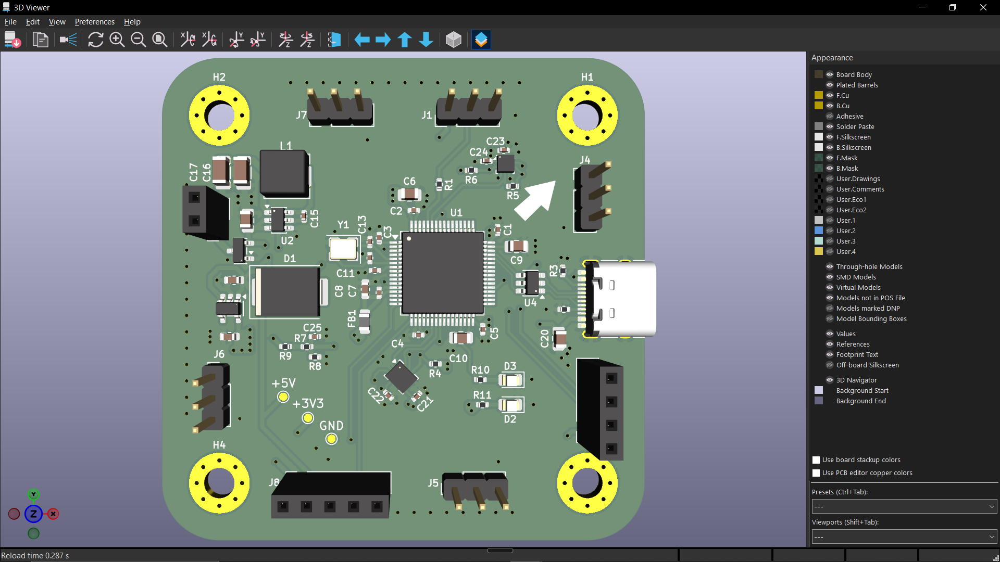
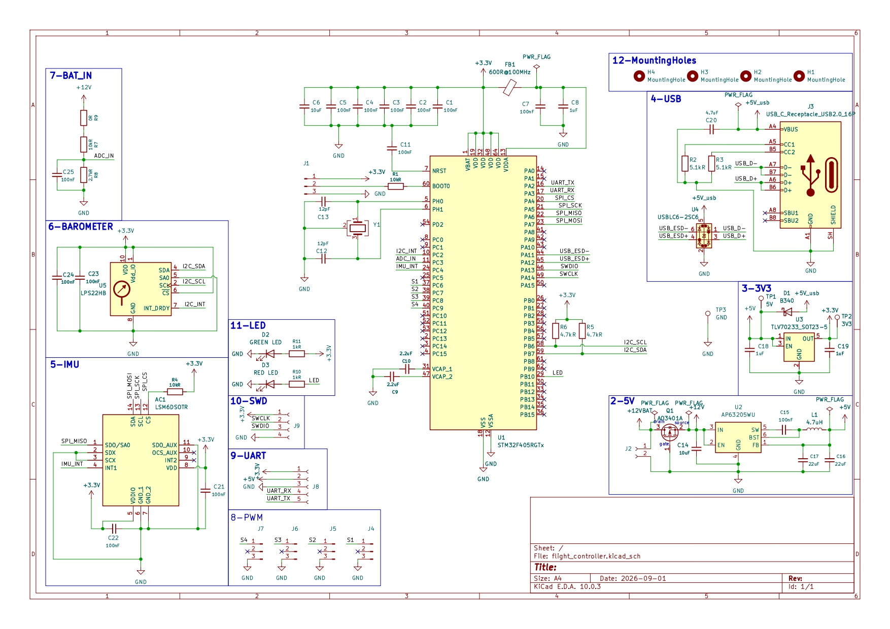
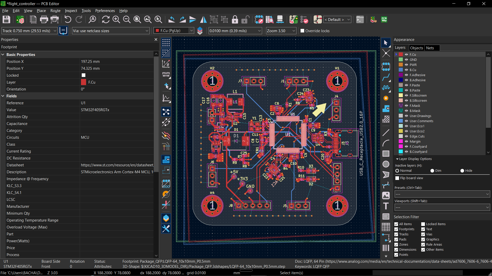
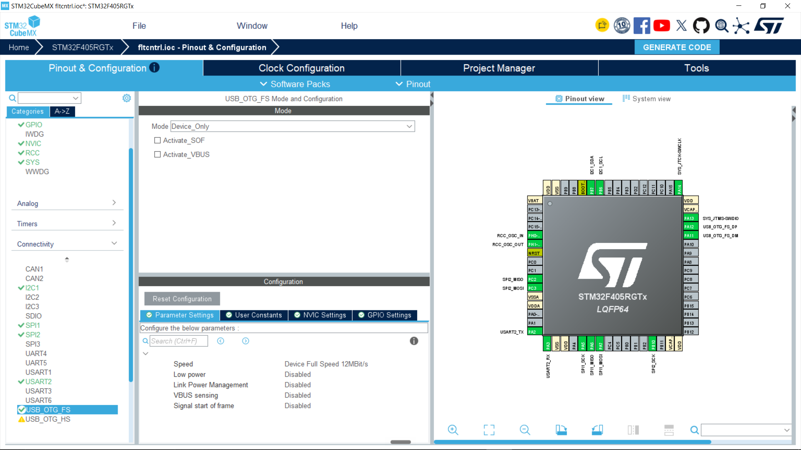

# STM32F405 Flight Controller

A 4-layer flight controller board for an F450 quadcopter frame, based on the STM32F405RGT6. Designed in KiCad 10 by [SparkLab DZ](https://sparklabdz.com).



## Features

| Block | Part | Notes |
|---|---|---|
| MCU | STM32F405RGT6 (LQFP64) | Cortex-M4F, 168 MHz, 1 MB Flash |
| IMU | LSM6DSO | SPI1, INT1 on PC4 |
| Barometer | LPS22HB | I2C1, address 0x5C |
| Motor outputs | 4x ESC | PC6 to PC9 on TIM3 (DShot capable) |
| 5V regulator | AP63205WU-7 | Synchronous buck, 3S LiPo input, 4.7 uH inductor |
| 3.3V regulator | TLV70233 | LDO from 5V |
| USB | USB Type-C 16P | PA11 / PA12 |
| Battery sense | 33k / 10k divider | PA0 (ADC) |

## Schematic



Full schematic as PDF: [post/flight_controller.pdf](post/flight_controller.pdf)

## PCB Layout



### Stackup

| Layer | Use |
|---|---|
| L1 | Signal + components |
| L2 | Solid GND plane |
| L3 | Power |
| L4 | Signal |

## Pin Map

| Function | Pin(s) |
|---|---|
| IMU SPI1 (CS / SCK / MISO / MOSI) | PA4 / PA5 / PA6 / PA7 |
| IMU interrupt (INT1) | PC4 |
| Baro I2C1 (SCL / SDA) | PB6 / PB7 |
| ESC 1 to 4 | PC6 / PC7 / PC8 / PC9 |
| USB D- / D+ | PA11 / PA12 |
| Battery voltage | PA0 |

Pin configuration in STM32CubeIDE:



## Repository Structure

```
stm32-flight-controller/
├── datasheets/                      Component datasheets
├── libs/                            Project symbols, footprints and 3D models
├── post/                            Schematic PDF and images
├── flight_controller.kicad_pro      KiCad project
├── flight_controller.kicad_sch      Schematic
├── flight_controller.kicad_pcb      PCB layout
├── flight_controller.csv            Bill of materials
├── fabrication-toolkit-options.json Fabrication Toolkit plugin settings
├── sym-lib-table                    Project symbol library table
├── fp-lib-table                     Project footprint library table
├── .gitattributes                   Git LFS settings
└── .gitignore
```

## Opening the Project

Requirements: **KiCad 10.0 or newer**. Older versions cannot open these files.

The repository uses Git LFS for large files, so install it before cloning:

```bash
git lfs install
git clone https://github.com/bachaaymene/stm32-flight-controller.git
```

Then open `flight_controller.kicad_pro` in KiCad.

All symbols, footprints and 3D models are stored in `libs/` with paths relative to the project (`${KIPRJMOD}`), so no external libraries are needed. If something appears missing, please open an issue.

## Manufacturing

The BOM is in `flight_controller.csv`.

Production files (Gerber, drill, BOM and CPL) for JLCPCB can be generated with the [Fabrication Toolkit](https://github.com/bennymeg/Fabrication-Toolkit) plugin. Install it from the KiCad Plugin and Content Manager, then run it from the PCB editor. The settings used for this board are saved in `fabrication-toolkit-options.json`.

## Status

- [x] Schematic
- [x] PCB layout
- [ ] Prototype fabrication
- [ ] Hardware bring-up
- [ ] Firmware

## License

This hardware design is released under the [CERN-OHL-S-2.0](LICENSE) license.

## Author

Aymene Bacha, [SparkLab DZ](https://sparklabdz.com)
